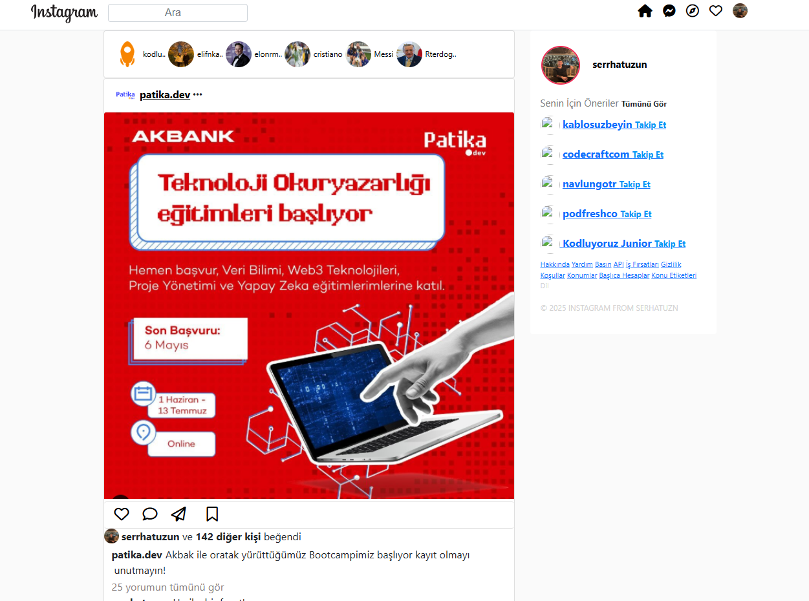

# Instagram Clone With Bootstrap

Bu proje, **Bootstrap** kullanılarak geliştirilmiş bir **Instagram klonu**dur. **HTML, CSS ve FontAwesome** gibi teknolojiler kullanılarak temel Instagram arayüzü oluşturulmuştur.

## 📌 Özellikler
- **Bootstrap 5** ile responsive tasarım
- **Navbar** (üst menü) ve **ikonlar**
- **Profil resmi** ve **hikayeler bölümü**
- **Instagram gönderileri** ve etkileşim butonları (beğeni, yorum, paylaşım)
- **Sağ panelde önerilen hesaplar** bölümü
- **FontAwesome ikonları ile zenginleştirilmiş butonlar**

## 📁 Dosya Yapısı
```
📂 project-folder
├── 📂 assets
│   ├── 📂 images
│   │   ├── ProfilFotograf.png
│   │   ├── Kullanıcı1.png
│   │   ├── Kullanıcı2.png
│   │   ├── Kullanıcı3.avif
│   │   ├── cr7.jpg
│   │   ├── messi.jpg
│   │   ├── Rterdogan.jpg
│   │   ├── patika.png
│   │   ├── akbankpatika.png
├── 📂 css
│   ├── bootstrap.min.css
│   ├── styles.css
├── 📂 js
│   ├── bootstrap.bundle.min.js
├── index.html
```

## 📌 Kullanılan Teknolojiler
- **HTML5**
- **CSS3** (Bootstrap 5 + Custom Styles)
- **FontAwesome** (ikonlar için)
- **JavaScript (Bootstrap JS)**

## 🚀 Kurulum & Çalıştırma
### 1️⃣ Projeyi Klonlayın
```sh
git clone https://github.com/kullaniciadi/instagram-clone.git
```

### 2️⃣ Proje Klasörüne Girin
```sh
cd instagram-clone
```

### 3️⃣ Bir Web Sunucusu Başlatın
Yerel bir sunucu çalıştırarak **HTML dosyalarını tarayıcıda açabilirsiniz**:

Python ile:
```sh
python -m http.server 8000
```
ve tarayıcınızda şu adresi açın:
```
http://localhost:8000
```

Veya **VS Code Live Server eklentisini** kullanabilirsiniz.

## 📷 Ekran Görüntüsü


## 🛠 Geliştirme Süreci
Bu proje, **Bootstrap 5** ve **FontAwesome** kullanılarak geliştirilmiştir. Amacı, **Instagram arayüzünü Bootstrap ile taklit etmektir**. Ekstra işlevsellik eklemek isterseniz **JavaScript** kullanabilirsiniz.

## 📜 Lisans
Bu proje **MIT Lisansı** ile korunmaktadır.

---
💡 **Geliştirme için katkıda bulunmak istiyorsanız pull request gönderebilirsiniz!** 🚀
